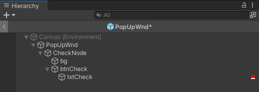
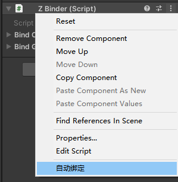
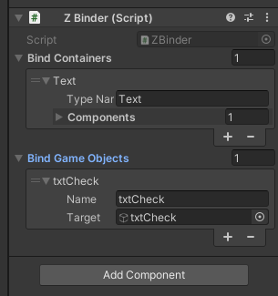

# 简易直观的Unity组件绑定工具
## 使用步骤
* 1.导入代码ZBinder.cs至项目路径
* 2.在需要绑定的UI上挂载ZBinder组件
* 3.设置需要绑定的节点tag为TAG_ZBINGDER
此处可以在脚本中自定义
```csharp
private const string TagKey = "TAG_ZBINDER";
```

* 4.点击ZBinder组件的自动绑定



* 5.它会把你自定义需要的组件和GameObject缓存起来 以供使用
此处可以在脚本中自定义需要绑定的组件类型
```csharp
    public static Type[] ComponentTypes =
    {
            typeof(Image),
            typeof(Text),
    };
```

## Lua绑定
打开ZBinder lua相关代码的注释
可以通过调用BindView函数将组件 按照 类型名字-组件 的格式 绑定到lua的table中

参考代码
绑定
```Lua
--绑定memberName对应的gameObject到table
function UIBaseView:BindViewComponentsByMemberName(view)
    view.ZBinder = view.ZBinder or {}
    local componentsBinder = view.m_uiObj:GetComponent("ZBinder")
    if componentsBinder then
        componentsBinder:BindView(view, view.ZBinder)
    end
end
```
获取GameObject参考
```Lua
self.ZBinder.GameObject.HistoryOrderPanel
```
获取Component参考
```Lua
self.ZBinder.ButtonEx.infoItemBtn
```
## 备注
如有需要修改和待完善的地方，请联系作者QQ：848832649。
感谢您所有的意见和建议。